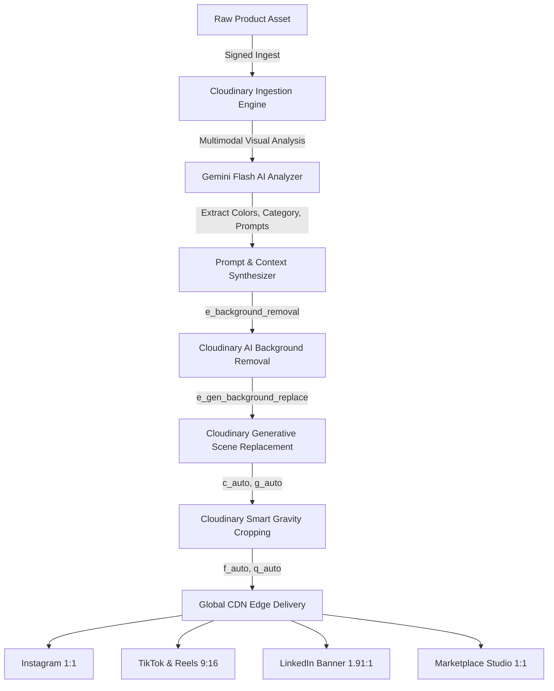

# ⚡ MEDIAFORGE AI

> **"One Asset. An Entire Campaign."**  
> Built for the **Cloudinary AI Hackathon 2026** — **Track 2: Generative Content Workflows**

[](https://cloudinary.com)
[](https://nextjs.org)
[](https://ai.google.dev)
[](https://prisma.io)
[](https://tailwindcss.com)

---

## 🌟 Executive Summary

Creating visual marketing campaigns across today’s fragmented digital landscape is painfully slow, expensive, and manual. Brands require vertical videos for TikTok and Instagram Reels (9:16), square cards for Instagram and product marketplaces (1:1), panoramic hero banners for websites (16:9), and sponsored update banners for LinkedIn (1.91:1)—not to mention channel-specific copy and hashtags.

**MediaForge AI solves this by re-imagining media production as an automated, generative pipeline powered end-to-end by Cloudinary AI.**

Upload a single raw, unedited product photograph or video. Within seconds, MediaForge AI analyzes its visual geometry, isolates the subject with sub-pixel edge detection, synthesizes realistic 3D environments and lighting, dynamically reformats for 4+ major platforms, and writes bespoke social copy.

---

## 🏗️ Cloudinary Architecture & Workflow (Track 2)

Cloudinary is the computational core of MediaForge AI, executing an automated 5-stage generative content workflow:



### The 5 Core Cloudinary Stages

1. **Asset Ingestion & Security**: Signed direct upload (`cloudinary.uploader.upload()`) with asset isolation.
2. **Multimodal Visual Intelligence**: Gemini Flash extracts product taxonomy, hex color palettes, lighting vectors, and prompts.
3. **AI Background Removal (`e_background_removal`)**: Clean subject extraction preserving subtle shadows and fine edges.
4. **Generative Background Replacement (`e_gen_background_replace`) & Generative Fill (`b_gen_fill`)**: Generates hyper-realistic contextual environments, ambient lighting, and outpainted canvas borders.
5. **Content-Aware Smart Cropping (`c_auto, g_auto`) & Edge Optimization (`f_auto, q_auto`)**: Subject-aware cropping for all social aspect ratios with automatic format conversion (AVIF/WebP) and adaptive compression.

---

## 🚀 Key Features

- 🪄 **Campaign Creation Studio (`/create`)**: Multi-step wizard allowing users to upload or choose from high-res demo assets, review AI visual analysis, select brand tone, and synthesize complete kits.
- 🎚️ **Interactive Before/After Slider**: Real-time draggable comparison between the raw original asset and Cloudinary's generative background replacement.
- 📱 **Multi-Platform Visual Renders**: Generates Instagram (1:1), TikTok/Stories (9:16), LinkedIn Feed (1.91:1), and E-Commerce Studio cuts.
- ✍️ **Omnichannel Marketing Copywriter**: Platform-tailored captions, ad headlines, conversion CTAs, and curated hashtag packages.
- 🧪 **Transformation Playground (`/transform`)**: Interactive developer sandbox to experiment with Cloudinary URL transformations in real time.
- 🎨 **Curated Preset Templates (`/templates`)**: Pre-engineered generative presets for Cyberpunk, Minimalist Studio, Alpine Dawn, and Luxury Showrooms.
- 📊 **Production Analytics (`/analytics`)**: Interactive Recharts telemetry tracking generation velocity, platform distribution, and CDN bandwidth optimization.
- 🛡️ **Zero-Failure Demo Mode**: Built-in fallback ensuring 100% reliable hackathon judging even without active third-party API credentials.

---

## 🛠️ Technology Stack

| Layer | Technology |
|---|---|
| **Framework** | Next.js 15 (App Router, Server Components & Actions) |
| **Language** | TypeScript 5 |
| **Media & AI Pipeline** | Cloudinary Generative Content API (`cloudinary` v2) |
| **Language AI** | Google Gemini 1.5 Flash (`@google/generative-ai`) |
| **Database & ORM** | SQLite + Prisma ORM 6 |
| **Styling** | Tailwind CSS + Custom Glassmorphism Theme |
| **Charts** | Recharts |
| **Icons** | Lucide React |

---

## ⚡ Quick Start & Local Setup

### 1. Clone the Repository

```bash
git clone https://github.com/HackIndiaXYZ/pixels-to-products-cloudinary-ai-hackathon-2026-arclight.git
cd pixels-to-products-cloudinary-ai-hackathon-2026-arclight
```

### 2. Install Dependencies

```bash
npm install
```

### 3. Configure Environment Variables

Create a `.env` file in the root directory:

```env
DATABASE_URL="file:./dev.db"

# Cloudinary Credentials (Required for live transformations)
NEXT_PUBLIC_CLOUDINARY_CLOUD_NAME="your-cloud-name"
CLOUDINARY_CLOUD_NAME="your-cloud-name"
CLOUDINARY_API_KEY="your-api-key"
CLOUDINARY_API_SECRET="your-api-secret"

# Gemini AI (Optional, fallbacks provided)
AI_API_KEY="your-gemini-api-key"

# Demo Mode (Enable for instant judging evaluation)
DEMO_MODE="true"
```

### 4. Initialize Database & Seed Showcase Data

```bash
npx prisma db push
node -r ts-node/register prisma/seed.ts
```

### 5. Launch the Development Server

```bash
npm run dev
```

Open [http://localhost:3000](http://localhost:3000) in your browser to experience MediaForge AI.

---

## 🏆 Hackathon Submission Details

- **Hackathon**: Cloudinary AI Hackathon 2026
- **Track**: Track 2 — Generative Content Workflows
- **Team Repository**: [HackIndiaXYZ/pixels-to-products-cloudinary-ai-hackathon-2026-arclight](https://github.com/HackIndiaXYZ/pixels-to-products-cloudinary-ai-hackathon-2026-arclight)
- **Personal Mirror**: [Devengoyal885/MediaForge-Ai](https://github.com/Devengoyal885/MediaForge-Ai)

---

## 📄 License

MIT © 2026 MediaForge AI. Built with ❤️ for the Cloudinary AI Hackathon.
